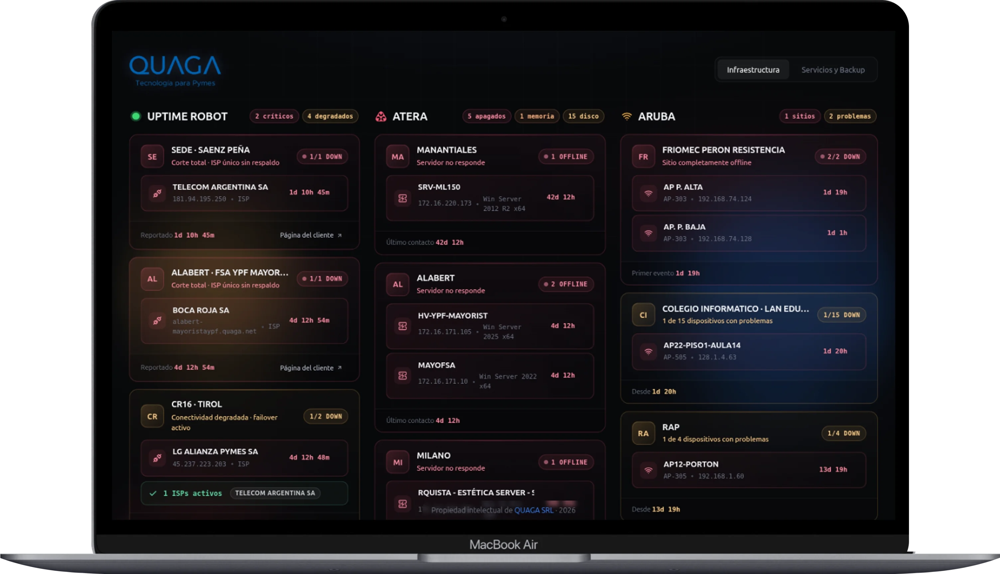

# QUAGA Monitor

**QUAGA Monitor** es un sistema avanzado de monitoreo de incidencias diseñado específicamente para la mesa de ayuda de **Quaga**. Proporciona una interfaz visual de alta densidad y estética "Luminescent Noir" para supervisar en tiempo real el estado de la infraestructura, servicios externos y alertas críticas.



## ✨ Características Principales

- 📊 **Panel de Control Centralizado**: Visualización en tiempo real de múltiples flujos de datos.
- 🔌 **Integraciones de Terceros**:
  - **Uptime Robot**: Monitoreo de disponibilidad de sitios y servicios.
  - **Atera**: Gestión de alertas RMM y soporte técnico.
  - **Aruba**: Estado de infraestructura de red.
- 🛡️ **Alertas de Backup**: Seguimiento detallado del estado de copias de seguridad.
- 🌐 **Servicios Externos**: Monitoreo de APIs y servicios críticos (Google, Claude, etc.).
- 🎨 **Diseño Premium**:
  - Interfaz Minimalista e informativa.
  - Estética **Luminescent Noir** con Glassmorphism.
  - Tipografía moderna (**Outfit**).
  - Animaciones fluidas con Framer Motion y Partículas.

## 🛠️ Stack Tecnológico

### Frontend

- **React 18** + **TypeScript**
- **Vite** (Build Tool)
- **Tailwind CSS** (Styling)
- **Framer Motion** (Animaciones)
- **TanStack Query** (Data Fetching)
- **Radix UI** + **Shadcn UI** (Componentes)
- **Wouter** (Routing)

### Backend

- **Node.js** + **Express**
- **Drizzle ORM** (Base de Datos)
- **Zod** (Validación de Esquemas)
- **Passport.js** (Autenticación)

## 🐳 Despliegue con Docker

Para desplegar el sistema rápidamente utilizando Docker, puedes usar los siguientes comandos:

### 1. Construir la Imagen

```bash
docker build -t monitoreov4 .
```

### 2. Ejecutar el Contenedor

```bash
docker run -d \
  --name monitoreo_v4 \
  --restart unless-stopped \
  -p 3030:3000 \
  --log-opt max-size=10m \
  --log-opt max-file=3 \
  monitoreov4
```

*El sistema estará disponible en `http://localhost:3030`.*

## 💻 Desarrollo Local

### Requisitos Previos

- Node.js (v18 o superior)
- PostgreSQL (opcional, configurado via variables de entorno)

### Pasos para Empezar

1. Clonar el repositorio:

   ```bash
   git clone https://github.com/sinoli1/quaga_monitor.git
   cd quaga_monitor
   ```

2. Instalar dependencias:

   ```bash
   npm install
   ```

3. Iniciar el entorno de desarrollo:

   ```bash
   npm run dev
   ```

4. Para construir para producción:

   ```bash
   npm run build
   ```

## 📂 Estructura del Proyecto

```text
├── client/          # Frontend en React (Vite)
│   ├── src/
│   │   ├── components/ # Componentes UI y Columnas de Monitoreo
│   │   ├── pages/      # Dashboard y Páginas principales
│   │   └── hooks/      # Hooks personalizados (API calls)
├── server/          # Backend en Express (Node.js)
│   ├── controllers/ # Lógica de negocio
│   ├── routes.ts    # Definición de rutas API
│   └── index.ts     # Punto de entrada del servidor
├── shared/          # Esquemas y Tipos compartidos (Drizzle/Zod)
└── dist/            # Compilación final (Backend + Frontend)
```

---

Desarrollado para **Quaga** - Sistema de Monitoreo v4.0
